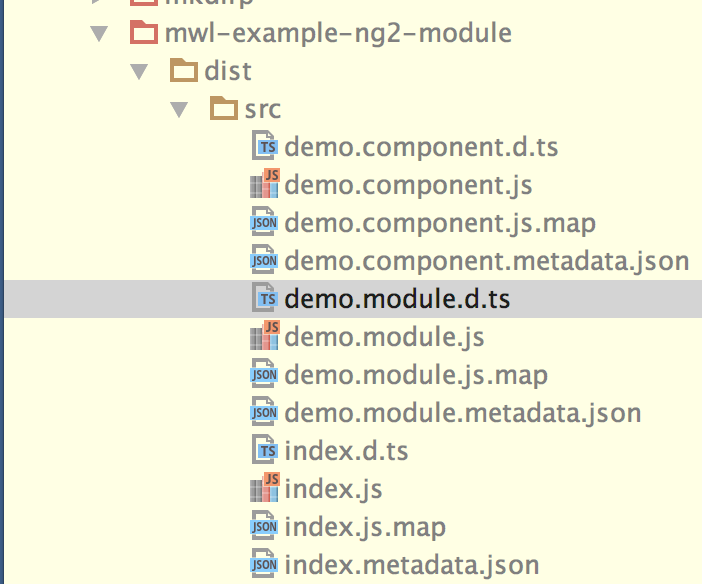
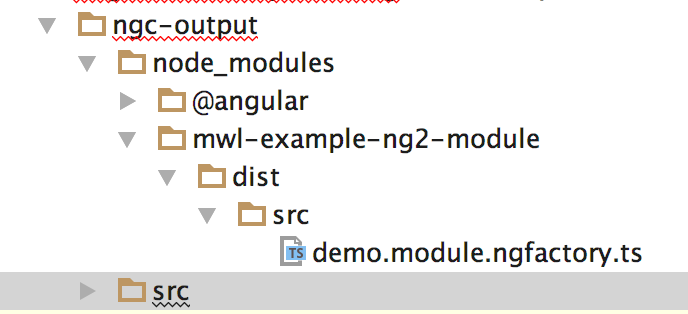
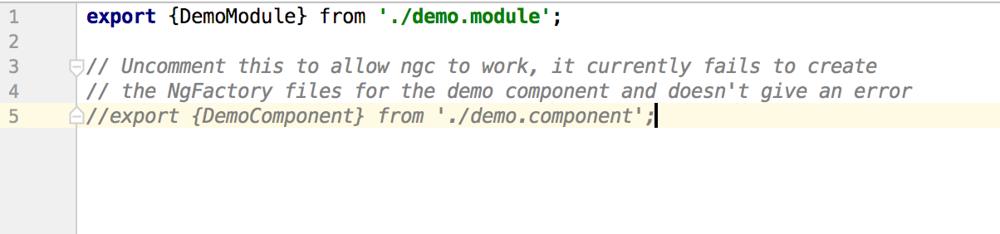

This is the source of the vendor library, as you can see there is a demo.component file which should have a ngfactory file created

However after running ngc on this library `npm run ngc`, only the NgModule is codegen'd, as the component is not exported from the 3rd party module.

There is no error message from `ngc` that the component could not be codegen'd, but there should be.

If the component is exported from the library's main/module file then `ngc` picks it up and will codegen it correctly

